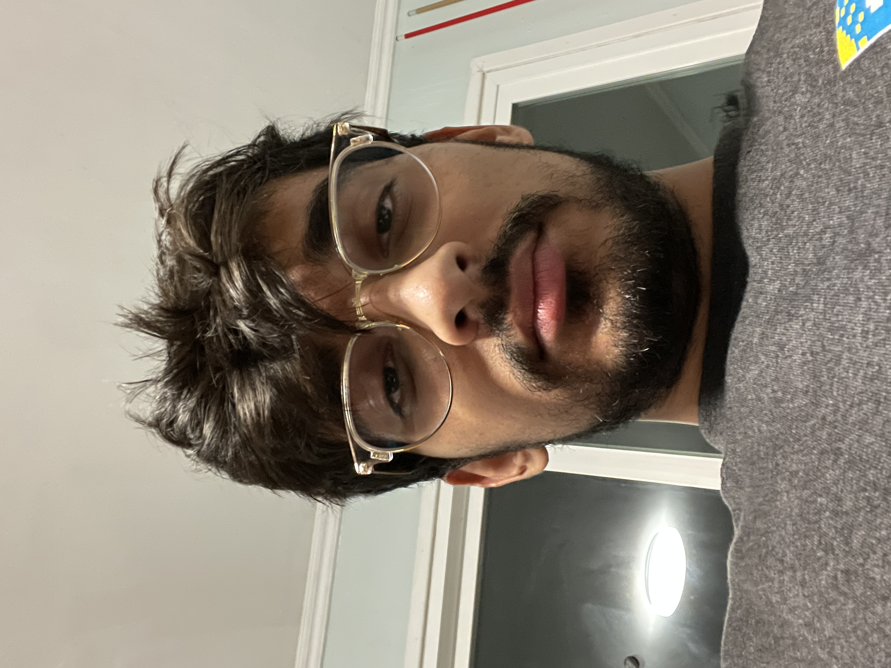

# Adarsh Patel
## About Me
My name is Adarsh Patel and I am a 3rd year computer science major. (A transfer student).
## What I look Like

*This was me on my last day of spring break. Please don't judge*
Below is the best picture I have of myself. Unfortunately, this was 4 years ago and I need to do another photoshoot once I increase my fashion sense.

> The LA Lakers are winning the 2023 NBA Championship - Adarsh Patel

Below is the first block of code I ever wrote:
``` cpp
#include <iostream>
using namespace std;

int main(){
  cout << "Hello World" << endl;
  return 0;
}
```

Click [here](https://github.com/adarsh249/connect6) to see an unfinished personal project I intend to complete one of these days.
[This is a relative link](./README.md)

- I
- not
- know
- do
- swim
- to
- how
- .

1. I
2. do
3. not
4. know
5. how
6. to
7. swim
8. .

Things I did while making this lab:
- [x] Go to all my first classes.
- [x] Eat lunch.
- [ ] Submit this lab.
